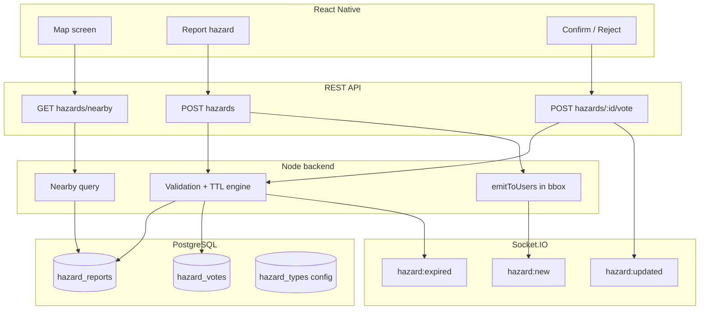

# Hazards System — Technical & Product Specification

This document defines the **crowdsourced hazards** feature for Convoy (Waze-style community reports) and how the **React Native** app should integrate with the backend.

**Status:** Phase 1 backend **implemented** (REST + Socket.IO). Mobile integration pending. Gamification hooks for hazard achievements not wired yet.

**Related systems already in place:**
- JWT auth on all `/api/*` routes
- Socket.IO with per-user rooms `user:{userId}` (see `src/socket/io.js`)
- Convoy live location via `convoy:location_update` / `convoy:member_location`
- Convoy `max_members` on create (currently **2–50**, default 15) — see [Convoy participant limit](#convoy-participant-limit-unlimited)

---

## 1. Product summary

### What “hazards” means here
User-generated, real-time road alerts:

| Type | `type` value | Typical TTL |
|------|----------------|-------------|
| Speed camera / radar | `speed_camera` | 2–6 hours |
| Police control | `police` | 30–90 minutes |
| Accident | `accident` | 1–3 hours |
| Road hazard (generic) | `road_hazard` | 1–2 hours |
| Construction | `construction` | 6–24 hours |
| Traffic incident | `traffic` | 30–120 minutes |

### Core rules (community-driven)
1. User reports a hazard at **exact GPS** (lat/lng + optional heading).
2. Backend stores the report and broadcasts to **nearby** users in real time.
3. Other users **confirm** (“still there”) or **reject** (“not there” / false).
4. Reports **expire automatically** if not reinforced (confirm extends life).
5. Optional later: external traffic APIs — **not** required for v1.

### Out of scope for v1 (can add later)
- Automatic detection from phone sensors
- ML moderation
- Full map tile hosting
- Per-country legal compliance review (product/legal should own)

---

## 2. Architecture overview



### Real-time strategy (recommended)
Mirror the convoy location pattern:

| Layer | Purpose |
|-------|---------|
| **REST** | Bootstrap map data on screen open / region change (debounced) |
| **Socket** | Push new/updated/expired hazards to online users near the event |

**Do not** rely on sockets alone — mobile needs REST for cold start, reconnect, and map panning.

### Scaling note (current deployment)
Convoy live locations use **in-memory** storage per server process. Hazards must use **PostgreSQL** (durable, queryable by geo). If you run **multiple PM2 instances**, socket broadcasts must either:
- use **Redis pub/sub** for hazard events, or
- run **one** Node process for Socket.IO, or
- accept that only users on the same worker get instant pushes (not acceptable long term).

Document this for DevOps; v1 single instance is OK.

---

## 3. Data model (proposed)

### 3.1 `hazard_types` (optional config table)
Allows tuning TTL/icons without app release.

| Column | Type | Notes |
|--------|------|-------|
| `type` | TEXT PK | e.g. `speed_camera` |
| `label` | TEXT | Display name |
| `icon_url` | TEXT | Map marker icon |
| `default_ttl_minutes` | INT | Initial lifetime |
| `confirm_extend_minutes` | INT | Added per confirm |
| `max_ttl_minutes` | INT | Cap total lifetime |
| `is_active` | BOOLEAN | |

### 3.2 `hazard_reports`
| Column | Type | Notes |
|--------|------|-------|
| `id` | SERIAL PK | |
| `reporter_id` | INT FK users | |
| `type` | TEXT | CHECK against allowed types |
| `lat` | NUMERIC(10,7) | |
| `lng` | NUMERIC(10,7) | |
| `heading` | NUMERIC | Optional degrees 0–360 |
| `description` | TEXT | Optional short note (max 280) |
| `status` | TEXT | `active`, `expired`, `removed` |
| `confirm_count` | INT | Denormalized |
| `reject_count` | INT | Denormalized |
| `trust_score` | NUMERIC | Computed score (see §4) |
| `expires_at` | TIMESTAMPTZ | Auto-expiry deadline |
| `last_confirmed_at` | TIMESTAMPTZ | |
| `created_at` | TIMESTAMPTZ | |
| `updated_at` | TIMESTAMPTZ | |

Indexes:
- `(status, expires_at)` for cleanup job
- `(lat, lng)` — for MVP bbox query; **PostGIS** `GEOGRAPHY` recommended for production radius search

### 3.3 `hazard_votes`
One vote per user per report.

| Column | Type | Notes |
|--------|------|-------|
| `hazard_id` | INT FK | |
| `user_id` | INT FK | |
| `vote` | TEXT | `confirm` or `reject` |
| `created_at` | TIMESTAMPTZ | |
| PK | `(hazard_id, user_id)` | |

Reporter **cannot** vote on own report (or their confirm is ignored for score).

---

## 4. Validation & expiry logic

### 4.1 Trust score (simple v1)
After each vote, recompute:

```
trust = confirm_count - (reject_count * 2)
```

Suggested visibility rules:
- **Show on map** if `status = active` AND `expires_at > now()` AND `trust >= -2`
- **Auto-remove** (status → `expired`) if `trust <= -3` OR `expires_at` passed

Tune thresholds via env/config.

### 4.2 TTL (time-to-live)
On **create**:
- `expires_at = now() + default_ttl_minutes(type)`

On **confirm** (by another user):
- `last_confirmed_at = now()`
- `expires_at = min(expires_at + confirm_extend_minutes, created_at + max_ttl_minutes)`

On **reject**:
- Do not extend TTL; high rejects trigger early expiry via trust score.

### 4.3 Background jobs
Run every 1–5 minutes (cron / node-cron / external scheduler):
1. `UPDATE hazard_reports SET status = 'expired' WHERE status = 'active' AND expires_at < now()`
2. For each newly expired batch, emit `hazard:expired` to users who were subscribed to that map region (or rely on client polling TTL locally)

Optional: archive old rows after 7–30 days.

### 4.4 Anti-spam
| Rule | Suggestion |
|------|------------|
| Max reports per user per hour | 10 |
| Min distance between reports by same user | 200 m within 10 min |
| Min account age / require auth | Already required |
| Duplicate same type within 50 m | Merge or reject as duplicate |

Return `429` with clear message when rate limited.

---

## 5. Geo: “nearby hazards”

### 5.1 Query model (REST)
Client sends map viewport:

**GET** `/api/hazards/nearby?min_lat=&max_lat=&min_lng=&max_lng=&types=speed_camera,police`

Or center + radius:

**GET** `/api/hazards/nearby?lat=&lng=&radius_km=15`

**Limits:**
- Max bbox diagonal ~50 km (reject larger to protect DB)
- Max 200 results per request
- Only `status=active` and `expires_at > now()`

### 5.2 Who receives real-time pushes
When a hazard is created/updated:
1. Query users **not required** — broadcast strategy options:

**Option A (recommended v1):** Emit to all connected sockets; client filters by distance locally.  
- Simple, works with current `user:{id}` rooms only if you add a “map subscription” room.

**Option B (better):** Client emits `hazard:subscribe` with bbox; server adds socket to room `hazard:bbox:{geohash}` and emits only to relevant rooms.

**Option C:** Server loads last known user location from a `user_locations` table updated on map move (more work).

**Recommendation:** **Option B** for production; **Option A** only for very early prototype.

---

## 6. REST API (implemented)

Base path: `/api/hazards`  
Auth: `Authorization: Bearer <token>` on all routes.

Standard envelope (same as rest of app):

```json
{
  "success": true,
  "status": "OK",
  "message": "…",
  "data": { }
}
```

### 6.1 List hazard types (catalog)
**GET** `/api/hazards/types`

Response example:

```json
{
  "success": true,
  "status": "OK",
  "data": {
    "types": [
      {
        "type": "speed_camera",
        "label": "Speed camera",
        "icon_url": "https://cdn.example.com/hazards/speed_camera.png",
        "default_ttl_minutes": 240,
        "confirm_extend_minutes": 60,
        "max_ttl_minutes": 720
      }
    ]
  }
}
```

### 6.2 Report hazard
**POST** `/api/hazards`

Request:

```json
{
  "type": "police",
  "lat": 31.5204,
  "lng": 74.3587,
  "heading": 180,
  "description": "Checkpoint near exit 12"
}
```

Response `201`:

```json
{
  "success": true,
  "status": "OK",
  "message": "Hazard reported",
  "data": {
    "hazard": {
      "id": 501,
      "type": "police",
      "lat": 31.5204,
      "lng": 74.3587,
      "heading": 180,
      "description": "Checkpoint near exit 12",
      "status": "active",
      "confirm_count": 0,
      "reject_count": 0,
      "trust_score": 0,
      "expires_at": "2026-05-02T12:30:00.000Z",
      "created_at": "2026-05-02T11:00:00.000Z",
      "reporter": {
        "id": 10,
        "username": "ahsen",
        "display_name": "Ahsen"
      }
    }
  }
}
```

Errors:
- `400` invalid coords/type
- `429` rate limited
- `409` duplicate too close

### 6.3 Nearby hazards (map bootstrap)
**GET** `/api/hazards/nearby?min_lat=31.4&max_lat=31.6&min_lng=74.2&max_lng=74.5`

Response:

```json
{
  "success": true,
  "status": "OK",
  "data": {
    "hazards": [
      {
        "id": 501,
        "type": "police",
        "lat": 31.5204,
        "lng": 74.3587,
        "heading": 180,
        "description": "Checkpoint near exit 12",
        "status": "active",
        "confirm_count": 3,
        "reject_count": 0,
        "trust_score": 3,
        "expires_at": "2026-05-02T12:45:00.000Z",
        "last_confirmed_at": "2026-05-02T11:40:00.000Z",
        "created_at": "2026-05-02T11:00:00.000Z",
        "distance_km": 2.3,
        "reporter": { "id": 10, "username": "ahsen", "display_name": "Ahsen" }
      }
    ]
  }
}
```

### 6.4 Hazard details
**GET** `/api/hazards/:id`

For bottom sheet / detail screen.

### 6.5 Confirm or reject
**POST** `/api/hazards/:id/vote`

Request:

```json
{
  "vote": "confirm"
}
```

`vote`: `confirm` | `reject`

Response:

```json
{
  "success": true,
  "status": "OK",
  "data": {
    "hazard": {
      "id": 501,
      "confirm_count": 4,
      "reject_count": 0,
      "trust_score": 4,
      "expires_at": "2026-05-02T13:00:00.000Z",
      "last_confirmed_at": "2026-05-02T11:50:00.000Z"
    },
    "my_vote": "confirm"
  }
}
```

Rules:
- One vote per user; changing vote updates row and recounts.
- Reporter vote ignored or disallowed.

### 6.6 My recent reports (optional)
**GET** `/api/hazards/mine?limit=20&offset=0`

For profile / contributions screen.

---

## 7. Socket.IO events (proposed)

Authentication: same JWT as today (`auth.token` or `Authorization` header on handshake).

### 7.1 Client → Server

#### `hazard:subscribe` (map viewport)
Subscribe to real-time updates for a region.

```json
{
  "min_lat": 31.4,
  "max_lat": 31.6,
  "min_lng": 74.2,
  "max_lng": 74.5
}
```

Server joins socket to one or more geohash rooms (implementation detail).

#### `hazard:unsubscribe`
Leave hazard rooms when map screen unmounts.

### 7.2 Server → Client

#### `hazard:new`
New report in subscribed region.

```json
{
  "hazard": {
    "id": 501,
    "type": "police",
    "lat": 31.5204,
    "lng": 74.3587,
    "heading": 180,
    "description": "Checkpoint near exit 12",
    "status": "active",
    "confirm_count": 0,
    "reject_count": 0,
    "trust_score": 0,
    "expires_at": "2026-05-02T12:30:00.000Z",
    "created_at": "2026-05-02T11:00:00.000Z"
  }
}
```

#### `hazard:updated`
After vote or TTL extension.

```json
{
  "hazard_id": 501,
  "confirm_count": 4,
  "reject_count": 0,
  "trust_score": 4,
  "expires_at": "2026-05-02T13:00:00.000Z",
  "last_confirmed_at": "2026-05-02T11:50:00.000Z"
}
```

#### `hazard:expired`
Removed from map.

```json
{
  "hazard_id": 501,
  "expired_at": "2026-05-02T12:30:00.000Z",
  "reason": "ttl"
}
```

`reason`: `ttl` | `rejected` | `moderation`

---

## 8. Mobile app flow (React Native)

### 8.1 Map screen lifecycle
1. Connect socket (already).
2. On map ready / region change (debounce 300–500 ms):
   - `GET /api/hazards/nearby` with viewport bbox
   - Render markers from response
3. Emit `hazard:subscribe` with same bbox.
4. Listen:
   - `hazard:new` → add marker (if not exists)
   - `hazard:updated` → update marker badge counts / expiry
   - `hazard:expired` → remove marker
5. On unmount: `hazard:unsubscribe`

### 8.2 Report flow
1. User long-press map or taps “Report”
2. Pick type (from `GET /api/hazards/types` cached on app start)
3. Confirm location (device GPS)
4. `POST /api/hazards`
5. Optimistic marker + toast; reconcile with response id

### 8.3 Detail / vote flow
1. Tap marker → bottom sheet with type, time left, confirm/reject counts
2. **Confirm** / **Not there** → `POST /api/hazards/:id/vote`
3. Update UI from response; socket may also deliver `hazard:updated` to others

### 8.4 UX recommendations
- Show **time remaining** from `expires_at`
- Color marker by `type`
- Badge with `confirm_count` (optional)
- Disable vote buttons on own report
- Offline: queue reports locally (optional phase 2)

---

## 9. Convoy participant limit (unlimited)

### Current behavior **(implemented)**
- `POST /api/convoys` accepts `max_members` (integer **2–50**, default **15**).
- Join checks `active_member_count >= convoy.max_members`.

### Client request: unlimited participants
**Product rule:** creator may omit limit or set `null` = **no cap**.

**Proposed API change:**

| `max_members` in request | Meaning |
|--------------------------|---------|
| omitted | default 15 (keep backward compatible) OR default unlimited — **decide with client** |
| `null` | unlimited |
| `2`–`50` | capped |
| `51+` | reject |

**DB change:**

```sql
ALTER TABLE convoys
  ALTER COLUMN max_members DROP NOT NULL,
  ADD CONSTRAINT convoys_max_members_range
    CHECK (max_members IS NULL OR (max_members >= 2 AND max_members <= 50));
```

**Join logic:**

```js
if (convoy.max_members != null && count >= convoy.max_members) { /* reject */ }
```

**Response field:** always return `max_members: null` when unlimited.

---

## 10. Gamification integration (Phase 2 — planned)

Your achievement list already includes Hazards (not implemented yet):

| Achievement | Metric (proposed) |
|-------------|-------------------|
| First Report | `hazards_reported >= 1` |
| Contributor | `hazards_reported >= 10` |
| Road Guardian | `hazard_confirmations >= 50` |
| Trusted Reporter | `hazard_confirmations_received >= 500` |

Add to `user_stats`:
- `hazards_reported`
- `hazards_confirmed` (votes cast)
- `hazard_confirmations_received` (confirms on your reports)

Award on:
- `POST /api/hazards` success
- `POST /api/hazards/:id/vote` with `confirm` (and when your report gets confirmed)

---

## 11. Implementation phases (backend)

### Phase 1 — Core (MVP) ✅
- [x] Migrations: `hazard_reports`, `hazard_votes`, seed `hazard_types` (`20260503000026_hazards_core.sql`)
- [x] REST: types, create, nearby, get by id, vote, mine
- [x] TTL expiry job (`startHazardExpiryJob`, default every 2 min)
- [x] Socket: `hazard:subscribe`, `hazard:new`, `hazard:updated`, `hazard:expired`
- [x] Rate limits + duplicate detection (in-memory bbox subscriptions)
- [x] Postman folder **Hazards** in `postman/Convoy_Collection.postman_collection.json`

### Phase 2 — Quality
- [ ] PostGIS radius queries (`lat/lng/radius_km` nearby — bbox only today)
- [ ] Geohash socket rooms (efficient broadcast at scale)
- [ ] Gamification hooks (`user_stats` hazard metrics)
- [ ] Redis pub/sub if multi-instance PM2

### Phase 3 — External data (optional)
- [ ] Ingest traffic/incident API as read-only layer (clearly labeled non-community)
- [ ] Merge with community hazards in `nearby` response (`source: user | external`)

---

## 12. Environment variables (suggested)

| Variable | Default | Purpose |
|----------|---------|---------|
| `HAZARD_REPORTS_PER_HOUR` | 10 | Anti-spam |
| `HAZARD_DUPLICATE_RADIUS_KM` | 0.2 | Duplicate window (~200 m) |
| `HAZARD_DUPLICATE_WINDOW_MINUTES` | 15 | Duplicate time window |
| `HAZARD_MAX_BBOX_SPAN_DEG` | 0.5 | Max viewport per axis |
| `HAZARD_EXPIRY_SWEEP_MS` | 120000 | Expiry background sweep |
| `HAZARD_NEARBY_MAX_RESULTS` | 200 | Query cap |
| `HAZARD_TRUST_HIDE_THRESHOLD` | -2 | Hide from map |
| `HAZARD_TRUST_EXPIRE_THRESHOLD` | -3 | Force expire |
| `HAZARD_BBOX_MAX_KM` | 50 | Max viewport size |

Per-type TTL can live in `hazard_types` table.

---

## 13. Security & abuse

- All endpoints authenticated
- Validate lat/lng bounds
- Sanitize `description` length
- Do not expose reporter exact identity on map to strangers (optional: show username only on detail)
- Log creates/votes in `api_logs` / optional `hazard_audit` table for moderation
- Consider report button on hazard (phase 2)

---

## 14. Testing checklist (QA)

1. Create hazard → appears in `nearby` within bbox
2. Second user confirm → `expires_at` extends, counts update
3. Rejects → trust drops, hazard expires early
4. Wait past `expires_at` → status expired, disappears from nearby
5. Socket: two devices in same area both receive `hazard:new`
6. Rate limit triggers after N reports
7. Convoy: `max_members: null` allows join beyond 50 (if unlimited implemented)

---

## 15. Open decisions for client/product

Please confirm:

1. **Default convoy size:** keep 15 cap vs default unlimited when field omitted?
2. **Map subscription:** geohash rooms (B) vs client-side filter (A)?
3. **Reporter visibility:** anonymous on map vs show display name?
4. **Vote change:** allow switching confirm ↔ reject?
5. **Exact TTL minutes** per hazard type (table in §1)?

Once confirmed, backend implementation can follow this spec exactly.

---

## Appendix: Example Postman folder (to add)

- Hazards → List types  
- Hazards → Report  
- Hazards → Nearby  
- Hazards → Get by id  
- Hazards → Vote confirm / reject  

Socket test events documented in §7.
